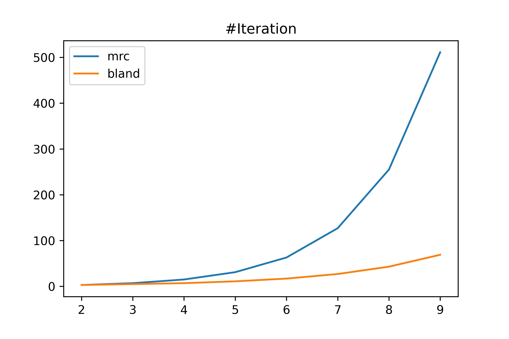
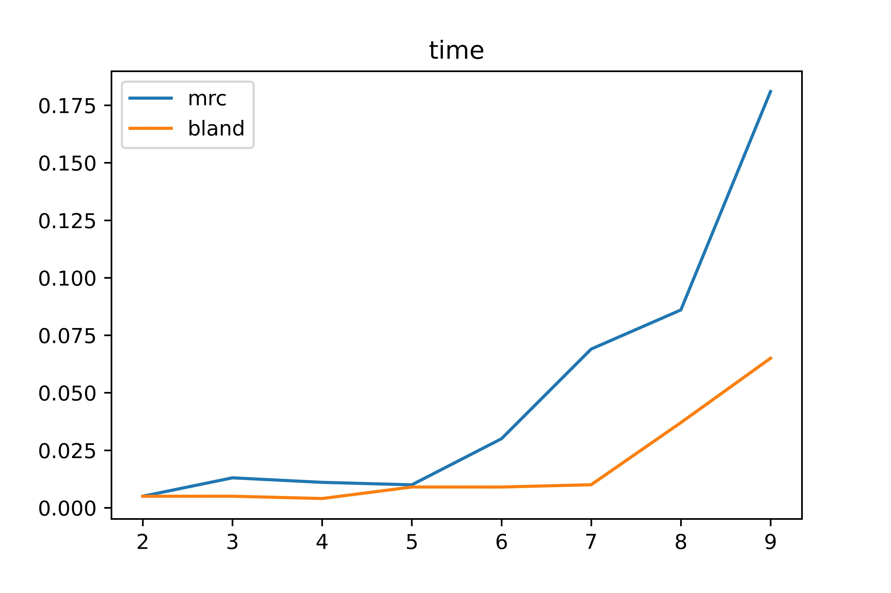

# HW2 報告

## 1. Maximum $n$

### pivot = "mrc" 之實驗數據:
(擷取部分)
|max iteration|N+1|times(secs)|status|exception|
|-|-|-|-|-|
|5000|13|1.63|1||
|9000|14|4.22|1||
|17000|15|4.37|1|N=14, status=4|
|33000|16|7.34|1||

可以看到當n = 14時,會遇到 numeracial difficulties (status = 4)
但很奇怪的是，n=15、16卻沒有這個問題。


### pivot = "bland" 之實驗數據:
(擷取部分)
|max iteration|N+1|times(secs)|status|exception|
|-|-|-|-|-|
|5000|18|1.21|1|N=(10,12,13,14,16,17), status=4)|
|6000|21|1.37|1|N=(19,20), status= 4|

也是一樣會有numeracial difficulties 問題，但更大的 n 卻沒有回報有問題的奇怪現象。


### 比較:
我使用 $n=$ 2~9 (上述測試沒有出現status = 4 的安全範圍)來測試兩種方法的執行時間 
(max_iteration = 10000):

結果:
#### mrc
|n  |iters|times               |status|
|---|-----|--------------------|------|
|2  |3    |0.004996776580810547|0     |
|3  |7    |0.013001441955566406|0     |
|4  |15   |0.011041879653930664|0     |
|5  |31   |0.009960412979125977|0     |
|6  |63   |0.030001163482666016|0     |
|7  |127  |0.06899547576904297 |0     |
|8  |255  |0.0859982967376709  |0     |
|9  |511  |0.1809988021850586  |0     |

#### bland
|n  |iters|times               |status|
|---|-----|--------------------|------|
|2  |3    |0.004981040954589844|0     |
|3  |5    |0.00500178337097168 |0     |
|4  |7    |0.004001140594482422|0     |
|5  |11   |0.009004831314086914|0     |
|6  |17   |0.009003162384033203|0     |
|7  |27   |0.009994745254516602|0     |
|8  |43   |0.0370020866394043  |0     |
|9  |69   |0.0650017261505127  |0     |




time: sec

從結果可以看到 bland 的方法在可行的範圍內比 mrc 在klee-minty的例子上來的好。

## 2.

Note: 執行時，請先將diet.xls 轉成.xlsx檔案，pandas 才能讀取(read_excel)

### 原始問題: 

$obj : z^*=\text{min} \text{ }(\textbf{price}^T*\textbf{x})$

s.t.

$\text{nutritions}^T*\textbf{x}\geq  \textbf{min\_intake}$

$\textbf{x}\geq 0$

為linear programming 中 dual 的形式
### 轉換
從dual 轉為 primal:

$obj: w^*=\text{max} \text{ } (\textbf{min\_intake}^T*{\textbf{y}})$

s.t.
$\text{nutritions}*{\textbf{y}} \leq  \textbf{price}$

${\textbf{y}}\geq 0$


依據linear programming primal-dual的性質:
$z^* = w^*$

### simplex_dual_edge_weight_strategy (scipy.optimize.linprog)

```steepest``` : choosing the most improvement of unit gradient

```dantzig``` : choosing the most negative reduced cost

```devex``` : choosing steepest-edge approximately one

沒有保證哪一種方法是最好的。

結果:

||steepest|dantzig|devex|
|-|-|-|-|
|time (secs)|0.00500|0.00499|0.00199|
|min_price|1.5703|1.5703|1.5703|
|iteration|13|7|8|

從結果也能看出，steepest 不一定是最好的，此資料集上devex 比steepest 效能還好。 